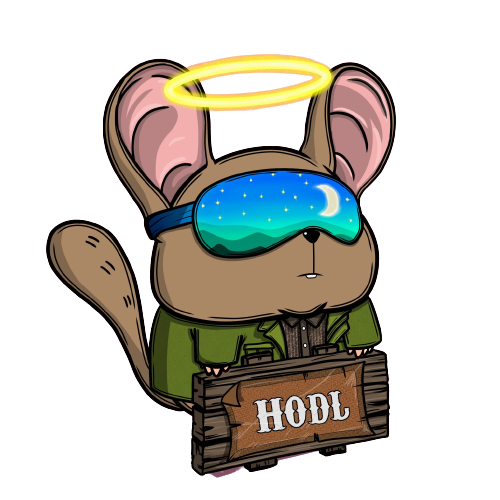
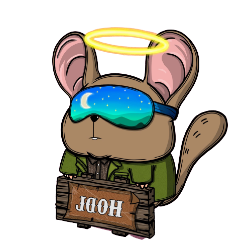

    <h1 align="left">😎 HAMMOUDA Ahmed Mustapha</h1>
    

**`Full Stack Software Engineer [ Python Developer | Tunisian ]`**

Welcome to my GitHub profile, I'm Hammouda Ahmed Mustapha! a highly motivated and disciplined Software engineer, I am deeply committed to pursuing a career in full-stack development. Through a combination of self-study and collaboration with my peers, I am continuously working to hone my skills and achieve my goal of becoming a full-fledged full-stack developer. 

My GitHub portfolio showcases a diverse range of coding projects, including those that I have independently developed, those that were inspired by instructional resources, and those that were created through collaborative efforts with other aspiring developers. For a comprehensive overview of my qualifications and expertise, I kindly direct you to my <a href="https://hammoudamustaphaahmed.github.io/MyResume.github.io/" target="_blank">portfolio website</a> or <a href="https://https://hammoudamustaphaahmed.github.io/terminalwebsite//" target="_blank">terminal website</a>. 

    
    
    

 
<h2 align="left">🌟 Languages & Tools</h2>

    
    
    
    
    
    
    
    
    
    
    
    
    
    
    
    
    
    
    
    
    
    
    
    
    
    
    
    
    

 
<h2 align="left">📊 GitHub Stats</h2>

    
    

 
 

<h2 align="left">🧰 Top used Languages</h2>

    
    
    

<h2 align="left">📌 GitHub Repo</h2>

    <a href="https://github.com/HAMMOUDAmustaphaahmed/terminalWebsite" target="_blank">
        
CarWize | Welcome to CarWize, your ultimate destination for automotive enthusiasts! 
</a>
        
(Flask | SQLALchemy | JWT)

    <a href="https://github.com/HAMMOUDAmustaphaahmed/flask-blockchain" target="_blank">
        
Blockchain simulation with a web interface on Flask.

    </a>
        
(Flask | JS)

    

    <a href="https://github.com/HAMMOUDAmustaphaahmed/kryptify_web3.0" target="_blank">
        
Explore the crypto world. Buy and sell cryptocurrencies easily on Kryptify.
</a>
        
(NextJS | Ethereum | Solidity)

    <a href="https://github.com/HAMMOUDAmustaphaahmed/RESTFUL-API" target="_blank">
        
Crud restful api
    
    </a>
    
(NestJS | Docker | Swagger | Prisma)

 
<h2 align="left">🐍 GitHub Contribution</h2>

    

